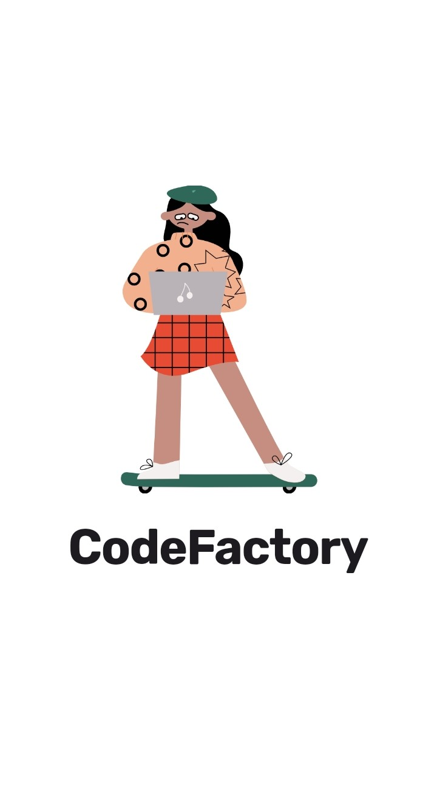
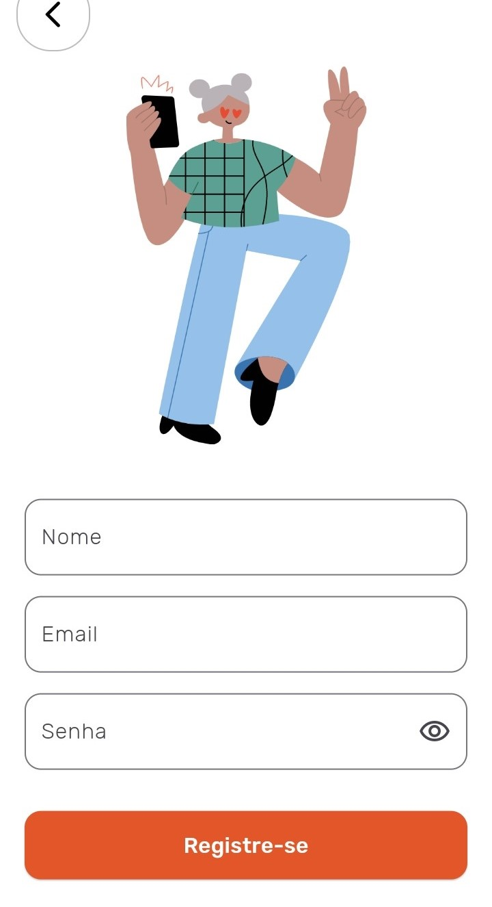

# Projeto Final PT-DEV TITAN (CodeFactory)
Projeto final do Programa Trainee de Mobile da TITAN - Empresa Júnior de Engenharia da Computação da UFBA. Este aplicativo consiste em um aplicativo mobile criado em Flutter/Dart de uma plataforma de cursos.

  
  
  

**O app possui um sistema de login e registro via Firebase**

  
  

**Possui tambem a opção de mudar o tema do app (dark/light)**

  
  
  

